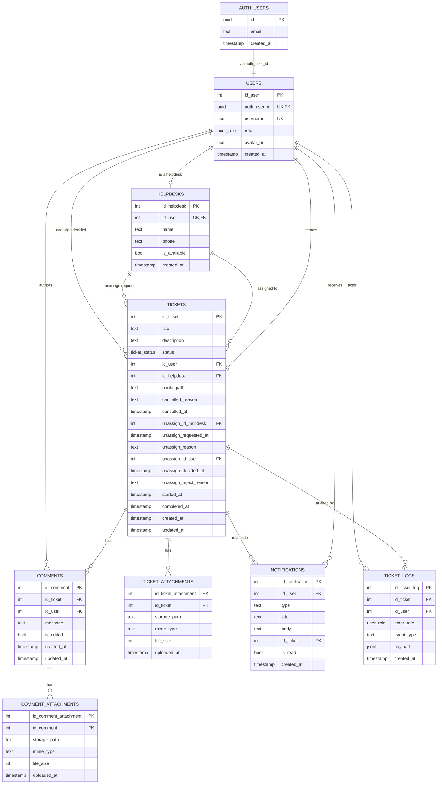

# Entity Relationship Diagram — UTS Mobile

> **Status:** Final, siap masuk laporan
> **Tanggal:** 2026-06-03
> **Versi:** 3.0 (Updated: konvensi penamaan)
> **Backend Target:** Supabase Postgres
> **Dokumen Terkait:** [`flow.md`](./flow.md), [`laporan.md`](./laporan.md), [`API.md`](./API.md)

---

## Konvensi Penamaan (WAJIB)

| Item            | Format                          | Contoh                                           |
| --------------- | ------------------------------- | ------------------------------------------------ |
| Tabel           | `lowercase_snake_plural`        | `users`, `helpdesks`, `tickets`                  |
| Primary Key     | `id_{nama_tabel_singular}`      | `id_user`, `id_ticket`, `id_comment`             |
| Foreign Key     | `id_{tabel_referensi_singular}` | `id_user`, `id_helpdesk`, `id_ticket`            |
| Timestamp       | `{event}_at` atau `created_at`/`updated_at` | `created_at`, `cancelled_at`, `started_at` |
| Boolean         | `is_*` / `has_*`                | `is_available`, `is_read`, `is_edited`           |
| Enum value      | `lowercase_snake`               | `in_progress`, `pending_unassign`               |

**Catatan penting:**
- Tabel `users` (sebelumnya `profiles`) — konsistensi dengan domain
- Field `comments.message` (sebelumnya `content`) — lebih natural untuk chat
- Tabel bisnis pakai `INT` (auto-increment), `UUID` hanya di `users.auth_user_id` (bridge ke Supabase Auth)

---

## 1. ERD Lengkap (Mermaid)



---

## 2. ERD Tabel Inti (Detail)

### 2.1. `auth.users` ↔ `users` ↔ `helpdesks`

```
┌─────────────────────┐
│   auth.users        │  (Supabase managed, UUID)
├─────────────────────┤
│ id (PK, uuid)       │  ← UUID dari Supabase
│ email               │
│ encrypted_password  │
│ created_at          │
└──────────┬──────────┘
           │ 1:1 (via auth_user_id)
           │ (auto-create via trigger)
           ▼
┌─────────────────────────┐
│   users                 │
├─────────────────────────┤
│ id_user (PK, int)       │  ← INT auto-increment
│ auth_user_id (uuid, UK) │  ← UUID bridge ke auth.users
│ username (UNIQUE)       │
│ role (user_role)        │◄──── enum: user | admin | helpdesk
│ avatar_url              │
│ created_at              │
└──────────┬──────────────┘
           │ 1:1 (hanya untuk role=helpdesk)
           ▼
┌─────────────────────────┐
│   helpdesks             │
├─────────────────────────┤
│ id_helpdesk (PK, int)   │
│ id_user (FK, UK)        │  ← 1-to-1 dengan users
│ name                    │
│ phone                   │
│ is_available            │
│ created_at              │
└─────────────────────────┘
```

**Catatan:** Semua primary key tabel bisnis menggunakan INT (auto-increment
via `GENERATED ALWAYS AS IDENTITY`), bukan UUID. Untuk relasi ke `auth.users`,
gunakan `users.auth_user_id` (UUID) sebagai perantara.

### 2.2. `tickets` — Tabel Sentral

```
┌──────────────────────────────────────────────┐
│              tickets                          │
├──────────────────────────────────────────────┤
│ id_ticket (PK, int)                          │
│ title                                        │
│ description                                  │
│ status (ticket_status)                       │
│                                              │
│ id_user (FK→users, creator)                  │
│ id_helpdesk (FK→helpdesks, NULL)             │
│                                              │
│ photo_path (text, Storage path)              │
│                                              │
│ cancelled_reason (text, NULL)                │
│ cancelled_at (timestamptz, NULL)             │
│                                              │
│ unassign_id_helpdesk (FK→helpdesks, NULL)    │
│ unassign_requested_at (timestamptz, NULL)    │
│ unassign_reason (text, NULL)                 │
│ unassign_id_user (FK→users, NULL)            │
│ unassign_decided_at (timestamptz, NULL)      │
│ unassign_reject_reason (text, NULL)          │
│                                              │
│ started_at (timestamptz, NULL)               │
│ completed_at (timestamptz, NULL)             │
│                                              │
│ created_at                                   │
│ updated_at (auto-update via trigger)         │
└──────────────────────────────────────────────┘
```

**Enum `ticket_status`:**
- `open` — tiket baru, belum di-assign
- `assigned` — sudah di-assign ke helpdesk
- `in_progress` — helpdesk sedang mengerjakan
- `pending_unassign` — helpdesk request un-assign
- `done` — selesai (terminal)
- `cancelled` — dibatalkan (terminal)

**State tracking fields (timestamps):**
- `created_at` — saat tiket dibuat
- `started_at` — pertama kali helpdesk buka (auto: open → in_progress)
- `completed_at` — saat helpdesk mark as done
- `cancelled_at` — saat user cancel
- `unassign_requested_at` — saat helpdesk request
- `unassign_decided_at` — saat admin approve/reject
- `updated_at` — setiap perubahan

### 2.3. Relasi `tickets` ke Tabel Lain

```
                          ┌──────────────┐
                          │   tickets    │
                          └──────┬───────┘
                                 │
        ┌────────────────────────┼────────────────────────┐
        │                        │                        │
        ▼                        ▼                        ▼
  ┌───────────┐         ┌──────────────┐         ┌──────────────┐
  │ comments  │         │  ticket_     │         │ ticket_logs  │
  │           │         │  attachments │         │              │
  └─────┬─────┘         └──────────────┘         └──────────────┘
        │
        ▼
  ┌──────────────────────┐
  │ comment_attachments  │
  └──────────────────────┘
```

---

## 3. SQL Lengkap (untuk dijalankan di Supabase)

```sql
-- ============================================
-- 1. ENUMS
-- ============================================
create type user_role as enum ('user', 'admin', 'helpdesk');

create type ticket_status as enum (
  'open',
  'assigned',
  'in_progress',
  'pending_unassign',
  'done',
  'cancelled'
);

create type notif_type as enum (
  'ticket_created',
  'ticket_assigned',
  'ticket_reassigned',
  'ticket_unassigned',
  'ticket_unassign_requested',
  'ticket_unassign_approved',
  'ticket_unassign_rejected',
  'ticket_in_progress',
  'ticket_done',
  'ticket_cancelled',
  'ticket_edited',
  'comment_added',
  'helpdesk_availability_changed'
);

-- ============================================
-- 2. USERS (extend auth.users)
-- ============================================
create table users (
  id_user int generated always as identity primary key,
  auth_user_id uuid unique references auth.users(id) on delete cascade,  -- UUID dari Supabase Auth
  username text unique not null,
  role user_role not null default 'user',
  avatar_url text,
  created_at timestamptz default now()
);

create index idx_users_role on users(role);
create index idx_users_auth_user_id on users(auth_user_id);

-- Auto-create user on signup
create or replace function handle_new_user()
returns trigger as $$
begin
  insert into public.users (auth_user_id, username, role)
  values (new.id, new.email, 'user');
  return new;
end;
$$ language plpgsql security definer;

create trigger on_auth_user_created
  after insert on auth.users
  for each row execute procedure handle_new_user();

-- ============================================
-- 3. HELPDESKS
-- ============================================
create table helpdesks (
  id_helpdesk int generated always as identity primary key,
  id_user int unique references users(id_user) on delete cascade,  -- 1-to-1 dengan users
  name text not null,
  phone text,
  is_available boolean not null default true,
  created_at timestamptz default now()
);

create index idx_helpdesks_is_available on helpdesks(is_available);

-- ============================================
-- 4. TICKETS
-- ============================================
create table tickets (
  id_ticket int generated always as identity primary key,
  title text not null,
  description text not null,
  status ticket_status not null default 'open',

  id_user int references users(id_user) on delete set null,           -- creator
  id_helpdesk int references helpdesks(id_helpdesk) on delete set null,

  photo_path text,

  cancelled_reason text,
  cancelled_at timestamptz,

  unassign_id_helpdesk int references helpdesks(id_helpdesk) on delete set null,
  unassign_requested_at timestamptz,
  unassign_reason text,
  unassign_id_user int references users(id_user) on delete set null,  -- admin yang approve/reject
  unassign_decided_at timestamptz,
  unassign_reject_reason text,

  started_at timestamptz,
  completed_at timestamptz,

  created_at timestamptz default now(),
  updated_at timestamptz default now()
);

create index idx_tickets_status on tickets(status);
create index idx_tickets_id_user on tickets(id_user);
create index idx_tickets_id_helpdesk on tickets(id_helpdesk);
create index idx_tickets_created_at_desc on tickets(created_at desc);

-- Auto-update updated_at
create or replace function update_updated_at()
returns trigger as $$
begin
  new.updated_at = now();
  return new;
end;
$$ language plpgsql;

create trigger trg_tickets_updated_at
  before update on tickets
  for each row execute procedure update_updated_at();

-- ============================================
-- 5. COMMENTS
-- ============================================
create table comments (
  id_comment int generated always as identity primary key,
  id_ticket int references tickets(id_ticket) on delete cascade not null,
  id_user int references users(id_user) on delete set null,
  message text not null,
  is_edited boolean not null default false,
  created_at timestamptz default now(),
  updated_at timestamptz default now()
);

create index idx_comments_id_ticket_created_at on comments(id_ticket, created_at asc);

create trigger trg_comments_updated_at
  before update on comments
  for each row execute procedure update_updated_at();

-- ============================================
-- 6. ATTACHMENTS
-- ============================================
create table ticket_attachments (
  id_ticket_attachment int generated always as identity primary key,
  id_ticket int references tickets(id_ticket) on delete cascade not null,
  storage_path text not null,
  mime_type text not null,
  file_size int not null check (file_size <= 5 * 1024 * 1024),
  uploaded_at timestamptz default now()
);

create index idx_ticket_attachments_id_ticket on ticket_attachments(id_ticket);

create table comment_attachments (
  id_comment_attachment int generated always as identity primary key,
  id_comment int references comments(id_comment) on delete cascade not null,
  storage_path text not null,
  mime_type text not null,
  file_size int not null check (file_size <= 5 * 1024 * 1024),
  uploaded_at timestamptz default now()
);

create index idx_comment_attachments_id_comment on comment_attachments(id_comment);

-- Enforce max 3 attachments per comment
create or replace function check_max_attachments()
returns trigger as $$
declare
  attachment_count int;
begin
  select count(*) into attachment_count
  from comment_attachments
  where id_comment = NEW.id_comment;

  if attachment_count >= 3 then
    raise exception 'Maximum 3 attachments per comment';
  end if;

  return NEW;
end;
$$ language plpgsql;

create trigger trg_check_max_attachments
  before insert on comment_attachments
  for each row execute procedure check_max_attachments();

-- ============================================
-- 7. NOTIFICATIONS
-- ============================================
create table notifications (
  id_notification int generated always as identity primary key,
  id_user int references users(id_user) on delete cascade not null,
  type notif_type not null,
  title text not null,
  body text not null,
  id_ticket int,  -- FK ke ticket terkait (opsional, no constraint karena bisa null)
  is_read boolean not null default false,
  created_at timestamptz default now()
);

create index idx_notifications_id_user_created_at
  on notifications(id_user, created_at desc);
create index idx_notifications_id_user_unread
  on notifications(id_user) where is_read = false;

-- ============================================
-- 8. TICKET LOGS (permanent, audit trail)
-- ============================================
create table ticket_logs (
  id_ticket_log int generated always as identity primary key,
  id_ticket int references tickets(id_ticket) on delete cascade not null,
  id_user int references users(id_user) on delete set null,
  actor_role user_role not null,
  event_type text not null,
  payload jsonb not null default '{}',
  created_at timestamptz default now()
);

create index idx_ticket_logs_id_ticket_created_at
  on ticket_logs(id_ticket, created_at desc);
create index idx_ticket_logs_id_user on ticket_logs(id_user);

-- ============================================
-- 9. ROW LEVEL SECURITY
-- ============================================

-- users
alter table users enable row level security;
create policy "Users viewable by authenticated" on users
  for select using (auth.role() = 'authenticated');
create policy "Users update own record" on users
  for update using (auth_user_id = auth.uid());
create policy "Admins update any user" on users
  for update using (
    exists (select 1 from users where auth_user_id = auth.uid() and role = 'admin')
  );

-- helpdesks
alter table helpdesks enable row level security;
create policy "Helpdesks viewable by authenticated" on helpdesks
  for select using (auth.role() = 'authenticated');
create policy "Helpdesks update own record" on helpdesks
  for update using (
    exists (select 1 from users where id_user = helpdesks.id_user and auth_user_id = auth.uid())
  );
create policy "Admins manage helpdesks" on helpdesks
  for all using (
    exists (select 1 from users where auth_user_id = auth.uid() and role = 'admin')
  );

-- tickets
alter table tickets enable row level security;
create policy "Tickets viewable by authenticated" on tickets
  for select using (auth.role() = 'authenticated');
create policy "Users create own ticket" on tickets
  for insert with check (
    exists (select 1 from users where id_user = tickets.id_user and auth_user_id = auth.uid())
    and status = 'open'
  );
create policy "Users update own open ticket" on tickets
  for update using (
    exists (select 1 from users where id_user = tickets.id_user and auth_user_id = auth.uid())
    and status = 'open'
  );
create policy "Helpdesk update assigned ticket" on tickets
  for update using (
    exists (
      select 1 from helpdesks h
      join users u on u.id_user = h.id_user
      where h.id_helpdesk = tickets.id_helpdesk
      and u.auth_user_id = auth.uid()
    )
  );
create policy "Admins update any ticket" on tickets
  for update using (
    exists (select 1 from users where auth_user_id = auth.uid() and role = 'admin')
  );

-- comments
alter table comments enable row level security;
create policy "Comments viewable by authenticated" on comments
  for select using (auth.role() = 'authenticated');
create policy "Authenticated add comment" on comments
  for insert with check (
    exists (select 1 from users where id_user = comments.id_user and auth_user_id = auth.uid())
  );
create policy "Author update own comment" on comments
  for update using (
    exists (select 1 from users where id_user = comments.id_user and auth_user_id = auth.uid())
  );
create policy "Author delete own comment" on comments
  for delete using (
    exists (select 1 from users where id_user = comments.id_user and auth_user_id = auth.uid())
  );

-- attachments
alter table ticket_attachments enable row level security;
alter table comment_attachments enable row level security;
create policy "Ticket attachments viewable" on ticket_attachments
  for select using (auth.role() = 'authenticated');
create policy "Comment attachments viewable" on comment_attachments
  for select using (auth.role() = 'authenticated');
create policy "Ticket attachments insert" on ticket_attachments
  for insert with check (auth.role() = 'authenticated');
create policy "Comment attachments insert" on comment_attachments
  for insert with check (
    exists (select 1 from comments c join users u on u.id_user = c.id_user
            where c.id_comment = comment_attachments.id_comment and u.auth_user_id = auth.uid())
  );
create policy "Ticket attachments delete" on ticket_attachments
  for delete using (
    exists (select 1 from tickets t join users u on u.id_user = t.id_user
            where t.id_ticket = ticket_attachments.id_ticket and u.auth_user_id = auth.uid())
    or exists (select 1 from users where auth_user_id = auth.uid() and role = 'admin')
  );
create policy "Comment attachments delete" on comment_attachments
  for delete using (
    exists (select 1 from comments c join users u on u.id_user = c.id_user
            where c.id_comment = comment_attachments.id_comment and u.auth_user_id = auth.uid())
  );

-- notifications
alter table notifications enable row level security;
create policy "Users view own notifications" on notifications
  for select using (
    exists (select 1 from users where id_user = notifications.id_user and auth_user_id = auth.uid())
  );
create policy "System insert notifications" on notifications
  for insert with check (auth.role() = 'service_role');
create policy "Users update own notifications" on notifications
  for update using (
    exists (select 1 from users where id_user = notifications.id_user and auth_user_id = auth.uid())
  );
create policy "Users delete own notifications" on notifications
  for delete using (
    exists (select 1 from users where id_user = notifications.id_user and auth_user_id = auth.uid())
  );

-- ticket_logs (read-only after insert)
alter table ticket_logs enable row level security;
create policy "Logs viewable by authenticated" on ticket_logs
  for select using (auth.role() = 'authenticated');
create policy "System insert logs" on ticket_logs
  for insert with check (auth.role() = 'service_role' or auth.uid() is not null);
-- NO update/delete policy = permanently locked

-- ============================================
-- 10. TRIGGER: log_ticket_changes
-- ============================================
create or replace function log_ticket_changes()
returns trigger as $$
declare
  v_event_type text;
  v_payload jsonb;
  v_actor_role user_role;
begin
  select role into v_actor_role from users where id_user = auth.uid();
  -- Note: ini fallback sederhana, idealnya lookup by auth.uid() ke users.auth_user_id
  if v_actor_role is null then v_actor_role := 'user'; end if;

  if (TG_OP = 'INSERT') then
    v_event_type := 'ticket.created';
    v_payload := jsonb_build_object('title', NEW.title, 'description', NEW.description);
  elsif (TG_OP = 'UPDATE') then
    if NEW.status != OLD.status then
      v_event_type := 'ticket.status_changed';
      v_payload := jsonb_build_object('from', OLD.status, 'to', NEW.status, 'id_helpdesk', NEW.id_helpdesk);
    elsif NEW.id_helpdesk IS DISTINCT FROM OLD.id_helpdesk then
      v_event_type := case when OLD.id_helpdesk is null then 'ticket.assigned' else 'ticket.reassigned' end;
      v_payload := jsonb_build_object('from', OLD.id_helpdesk, 'to', NEW.id_helpdesk);
    elsif NEW.title IS DISTINCT FROM OLD.title or NEW.description IS DISTINCT FROM OLD.description then
      v_event_type := 'ticket.updated';
      v_payload := jsonb_build_object(
        'before', jsonb_build_object('title', OLD.title, 'description', OLD.description),
        'after', jsonb_build_object('title', NEW.title, 'description', NEW.description)
      );
    elsif NEW.cancelled_reason IS DISTINCT FROM OLD.cancelled_reason or (NEW.status = 'cancelled' and OLD.status != 'cancelled') then
      v_event_type := 'ticket.cancelled';
      v_payload := jsonb_build_object('reason', NEW.cancelled_reason, 'cancelled_at', NEW.cancelled_at);
    elsif NEW.unassign_id_helpdesk IS DISTINCT FROM OLD.unassign_id_helpdesk then
      v_event_type := 'ticket.unassign_requested';
      v_payload := jsonb_build_object('requested_by', NEW.unassign_id_helpdesk, 'reason', NEW.unassign_reason);
    elsif NEW.unassign_id_user IS DISTINCT FROM OLD.unassign_id_user then
      v_event_type := case when NEW.status = 'open' then 'ticket.unassign_approved' else 'ticket.unassign_rejected' end;
      v_payload := jsonb_build_object('decided_by', NEW.unassign_id_user, 'reject_reason', NEW.unassign_reject_reason);
    else
      v_event_type := 'ticket.updated';
      v_payload := jsonb_build_object('changes', to_jsonb(NEW) - to_jsonb(OLD));
    end if;
  end if;

  insert into ticket_logs (id_ticket, id_user, actor_role, event_type, payload)
  values (NEW.id_ticket, auth.uid(), v_actor_role, v_event_type, v_payload);

  return NEW;
end;
$$ language plpgsql security definer;

create trigger trg_log_ticket_changes
  after insert or update on tickets
  for each row execute procedure log_ticket_changes();

-- ============================================
-- 11. TRIGGER: log_comment_changes
-- ============================================
create or replace function log_comment_changes()
returns trigger as $$
declare
  v_actor_role user_role;
begin
  select role into v_actor_role from users where id_user = auth.uid();
  if v_actor_role is null then v_actor_role := 'user'; end if;

  if (TG_OP = 'INSERT') then
    insert into ticket_logs (id_ticket, id_user, actor_role, event_type, payload)
    values (NEW.id_ticket, auth.uid(), v_actor_role, 'comment.added',
            jsonb_build_object('id_comment', NEW.id_comment, 'snippet', left(NEW.message, 100)));
  elsif (TG_OP = 'UPDATE') then
    insert into ticket_logs (id_ticket, id_user, actor_role, event_type, payload)
    values (NEW.id_ticket, auth.uid(), v_actor_role, 'comment.edited',
            jsonb_build_object('id_comment', NEW.id_comment, 'before', OLD.message, 'after', NEW.message));
  elsif (TG_OP = 'DELETE') then
    insert into ticket_logs (id_ticket, id_user, actor_role, event_type, payload)
    values (OLD.id_ticket, auth.uid(), v_actor_role, 'comment.deleted',
            jsonb_build_object('id_comment', OLD.id_comment, 'message', OLD.message));
  end if;

  return coalesce(NEW, OLD);
end;
$$ language plpgsql security definer;

create trigger trg_log_comment_changes
  after insert or update or delete on comments
  for each row execute procedure log_comment_changes();

-- ============================================
-- 12. TRIGGER: ticket_notifications
-- ============================================
create or replace function create_ticket_notifications()
returns trigger as $$
begin
  -- INSERT → notify all admin
  if TG_OP = 'INSERT' then
    insert into notifications (id_user, type, title, body, id_ticket)
    select id_user, 'ticket_created', 'Tiket baru',
           'User membuat tiket baru: ' || NEW.title, NEW.id_ticket
    from users where role = 'admin';
  end if;

  -- Assigned → notify user & helpdesk
  if TG_OP = 'UPDATE' and NEW.status = 'assigned' and OLD.status = 'open' then
    insert into notifications (id_user, type, title, body, id_ticket)
    values (NEW.id_user, 'ticket_assigned', 'Tiket di-assign',
            'Tiket Anda telah ditugaskan ke helpdesk.', NEW.id_ticket);
    insert into notifications (id_user, type, title, body, id_ticket)
    values (
      (select u.id_user from helpdesks h join users u on u.id_user = h.id_user where h.id_helpdesk = NEW.id_helpdesk),
      'ticket_assigned', 'Tiket baru ditugaskan',
      'Admin menugaskan tiket kepada Anda.', NEW.id_ticket
    );
  end if;

  -- Reassigned → notify old helpdesk, new helpdesk, user
  if TG_OP = 'UPDATE' and NEW.id_helpdesk IS DISTINCT FROM OLD.id_helpdesk
     and NEW.status in ('assigned', 'in_progress') and OLD.id_helpdesk is not null then
    if OLD.id_helpdesk is not null then
      insert into notifications (id_user, type, title, body, id_ticket)
      values (
        (select u.id_user from helpdesks h join users u on u.id_user = h.id_user where h.id_helpdesk = OLD.id_helpdesk),
        'ticket_unassigned', 'Tiket dilepas',
        'Tiket dilepas dari Anda.', NEW.id_ticket
      );
    end if;
    insert into notifications (id_user, type, title, body, id_ticket)
    values (
      (select u.id_user from helpdesks h join users u on u.id_user = h.id_user where h.id_helpdesk = NEW.id_helpdesk),
      'ticket_assigned', 'Tiket ditugaskan ke Anda',
      'Admin menugaskan tiket kepada Anda.', NEW.id_ticket
    );
  end if;

  -- In progress → notify user
  if TG_OP = 'UPDATE' and NEW.status = 'in_progress' and OLD.status = 'assigned' then
    insert into notifications (id_user, type, title, body, id_ticket)
    values (NEW.id_user, 'ticket_in_progress', 'Tiket sedang dikerjakan',
            'Helpdesk mulai mengerjakan tiket Anda.', NEW.id_ticket);
  end if;

  -- Done → notify user & all admin
  if TG_OP = 'UPDATE' and NEW.status = 'done' and OLD.status != 'done' then
    insert into notifications (id_user, type, title, body, id_ticket)
    values (NEW.id_user, 'ticket_done', 'Tiket selesai',
            'Tiket Anda telah selesai.', NEW.id_ticket);
    insert into notifications (id_user, type, title, body, id_ticket)
    select id_user, 'ticket_done', 'Tiket selesai',
           'Helpdesk menyelesaikan tiket.', NEW.id_ticket
    from users where role = 'admin';
  end if;

  -- Cancelled → notify all admin
  if TG_OP = 'UPDATE' and NEW.status = 'cancelled' and OLD.status != 'cancelled' then
    insert into notifications (id_user, type, title, body, id_ticket)
    select id_user, 'ticket_cancelled', 'Tiket dibatalkan',
           'User membatalkan tiket. Alasan: ' || coalesce(NEW.cancelled_reason, '-'),
           NEW.id_ticket
    from users where role = 'admin';
  end if;

  -- Pending unassign → notify all admin
  if TG_OP = 'UPDATE' and NEW.status = 'pending_unassign' and OLD.status in ('assigned', 'in_progress') then
    insert into notifications (id_user, type, title, body, id_ticket)
    select id_user, 'ticket_unassign_requested', 'Request un-assign',
           'Helpdesk request un-assign. Alasan: ' || coalesce(NEW.unassign_reason, '-'),
           NEW.id_ticket
    from users where role = 'admin';
  end if;

  -- Unassign approved → notify helpdesk
  if TG_OP = 'UPDATE' and NEW.status = 'open' and OLD.status = 'pending_unassign' and NEW.unassign_id_user is not null then
    insert into notifications (id_user, type, title, body, id_ticket)
    values (
      (select u.id_user from helpdesks h join users u on u.id_user = h.id_user where h.id_helpdesk = NEW.unassign_id_helpdesk),
      'ticket_unassign_approved', 'Un-assign disetujui',
      'Admin menyetujui request un-assign Anda.', NEW.id_ticket
    );
  end if;

  -- Unassign rejected → notify helpdesk
  if TG_OP = 'UPDATE' and NEW.status in ('assigned', 'in_progress') and OLD.status = 'pending_unassign' and NEW.unassign_reject_reason is not null then
    insert into notifications (id_user, type, title, body, id_ticket)
    values (
      (select u.id_user from helpdesks h join users u on u.id_user = h.id_user where h.id_helpdesk = NEW.unassign_id_helpdesk),
      'ticket_unassign_rejected', 'Un-assign ditolak',
      'Admin menolak request un-assign Anda.', NEW.id_ticket
    );
  end if;

  return NEW;
end;
$$ language plpgsql security definer;

create trigger trg_create_ticket_notifications
  after insert or update on tickets
  for each row execute procedure create_ticket_notifications();

-- ============================================
-- 13. TRIGGER: comment_notifications
-- ============================================
create or replace function create_comment_notifications()
returns trigger as $$
begin
  insert into notifications (id_user, type, title, body, id_ticket)
  select distinct u.id_user, 'comment_added', 'Komentar baru',
         left(NEW.message, 100), NEW.id_ticket
  from tickets t
  cross join users u
  where t.id_ticket = NEW.id_ticket
    and u.id_user != NEW.id_user
    and u.role != 'admin'  -- admin TIDAK dapat notif dari comment
    and (
      u.id_user = t.id_user
      or u.id_user = (select h.id_user from helpdesks h where h.id_helpdesk = t.id_helpdesk)
    );

  return NEW;
end;
$$ language plpgsql security definer;

create trigger trg_create_comment_notifications
  after insert on comments
  for each row execute procedure create_comment_notifications();

-- ============================================
-- 14. STORAGE BUCKETS
-- ============================================
insert into storage.buckets (id, name, public)
values
  ('ticket-photos', 'ticket-photos', true),
  ('comment-attachments', 'comment-attachments', true),
  ('avatars', 'avatars', true);

-- Storage policies
create policy "Public view ticket photos" on storage.objects
  for select to public
  using (bucket_id = 'ticket-photos');

create policy "Auth upload ticket photos" on storage.objects
  for insert to authenticated
  with check (bucket_id = 'ticket-photos');

create policy "Public view comment attachments" on storage.objects
  for select to public
  using (bucket_id = 'comment-attachments');

create policy "Auth upload comment attachments" on storage.objects
  for insert to authenticated
  with check (bucket_id = 'comment-attachments');

create policy "Public view avatars" on storage.objects
  for select to public
  using (bucket_id = 'avatars');

create policy "Auth upload own avatar" on storage.objects
  for insert to authenticated
  with check (
    bucket_id = 'avatars'
    and auth.uid()::text = (storage.foldername(name))[1]
  );

-- ============================================
-- 15. SEED DATA
-- ============================================
-- Buat admin user dulu via Supabase Auth dashboard, lalu:
-- update users set role = 'admin' where username = 'admin@uts.id';

-- Seed dummy helpdesks (setelah profile helpdesk dibuat)
-- insert into helpdesks (id_user, name, is_available) values
--   ((select id_user from users where username = 'udin@uts.id'), 'Alan Udin', true),
--   ((select id_user from users where username = 'viki@uts.id'), 'Vikibara Can', true),
--   ((select id_user from users where username = 'rizki@uts.id'), 'Rizkimok', true);
```

---

## 4. Relasi Antar Tabel (Ringkasan)

| Relasi                                                  | Tipe        | Cascade on Delete         |
| ------------------------------------------------------- | ----------- | ------------------------- |
| `auth.users` → `users` (auth_user_id)                   | 1-to-1      | CASCADE                   |
| `users` → `helpdesks` (id_user)                         | 1-to-1      | CASCADE                   |
| `users` → `tickets` (id_user, creator)                  | 1-to-many   | SET NULL                  |
| `helpdesks` → `tickets` (id_helpdesk)                   | 1-to-many   | SET NULL                  |
| `helpdesks` → `tickets` (unassign_id_helpdesk)          | 1-to-many   | SET NULL                  |
| `users` → `tickets` (unassign_id_user)                  | 1-to-many   | SET NULL                  |
| `tickets` → `comments` (id_ticket)                      | 1-to-many   | CASCADE                   |
| `tickets` → `ticket_attachments` (id_ticket)            | 1-to-many   | CASCADE                   |
| `comments` → `comment_attachments` (id_comment)         | 1-to-many   | CASCADE                   |
| `users` → `comments` (id_user, author)                  | 1-to-many   | SET NULL                  |
| `users` → `notifications` (id_user)                     | 1-to-many   | CASCADE                   |
| `tickets` → `notifications` (id_ticket)                | 1-to-many   | (no FK constraint)        |
| `users` → `ticket_logs` (id_user, actor)                | 1-to-many   | SET NULL                  |
| `tickets` → `ticket_logs` (id_ticket)                  | 1-to-many   | CASCADE                   |

---

## 5. Index Strategy

| Index                                                  | Tujuan                                   |
| ------------------------------------------------------ | ---------------------------------------- |
| `idx_users_role`                                       | Filter by role (admin)                   |
| `idx_users_auth_user_id`                               | Lookup by Supabase Auth UUID             |
| `idx_helpdesks_is_available`                           | Filter helpdesk tersedia                 |
| `idx_tickets_status`                                   | Filter by status                         |
| `idx_tickets_id_user`                                  | "Tiket saya" (user)                      |
| `idx_tickets_id_helpdesk`                              | "Tugas saya" (helpdesk)                  |
| `idx_tickets_created_at_desc`                          | Cursor pagination (list tiket)           |
| `idx_comments_id_ticket_created_at`                    | Comment per tiket, sorted                |
| `idx_notifications_id_user_created_at`                 | Notifikasi per user, cursor pagination   |
| `idx_notifications_id_user_unread` (partial)           | Filter unread, lebih cepat               |
| `idx_ticket_logs_id_ticket_created_at`                 | Log per tiket, sorted                    |
| `idx_ticket_logs_id_user`                              | "Aktivitas saya" (agregat per user)      |

---

## 6. Constraint & Check

| Constraint                                          | Tabel                  | Tujuan                       |
| --------------------------------------------------- | ---------------------- | ---------------------------- |
| `role IN ('user', 'admin', 'helpdesk')`             | users                  | Validasi role                |
| `status IN (enum)`                                  | tickets                | Validasi status              |
| `file_size <= 5 MB`                                 | attachments            | Max upload size              |
| Max 3 attachments per comment (trigger)             | comment_attachments    | Limit foto                   |
| `cancelled_reason NOT NULL` saat `status=cancelled` | (app-level check)      | Wajib isi alasan             |
| `unassign_reason NOT NULL` saat `status=pending_unassign` | (app-level check) | Wajib isi alasan             |

---

## 7. Auto-Trigger Ringkasan

| Trigger                            | Tabel        | When           | Effect                                  |
| ---------------------------------- | ------------ | -------------- | --------------------------------------- |
| `on_auth_user_created`             | auth.users   | AFTER INSERT   | Insert ke `users`                       |
| `trg_tickets_updated_at`           | tickets      | BEFORE UPDATE  | Set `updated_at = now()`                |
| `trg_comments_updated_at`          | comments     | BEFORE UPDATE  | Set `updated_at = now()`                |
| `trg_check_max_attachments`        | comment_attachments | BEFORE INSERT | Reject kalau >= 3 attachment        |
| `trg_log_ticket_changes`           | tickets      | AFTER I/U      | Insert ke `ticket_logs`                 |
| `trg_log_comment_changes`          | comments     | AFTER I/U/D    | Insert ke `ticket_logs`                 |
| `trg_create_ticket_notifications`  | tickets      | AFTER I/U      | Insert ke `notifications`               |
| `trg_create_comment_notifications` | comments     | AFTER INSERT   | Insert ke `notifications` (no admin)    |

---

## 8. Catatan Implementasi

### 8.1. Kenapa Pakai JSONB untuk `ticket_logs.payload`?

- Fleksibel: setiap event bisa punya struktur payload beda
- Tidak perlu alter tabel tiap tambah event type baru
- Queryable: bisa `WHERE payload->>'reason' = '...'`

### 8.2. Kenapa `auth.users` Dipisah dari `users`?

- `auth.users` managed by Supabase (auth credentials, encryption, dll) — pakai UUID
- `users` untuk app-level data (username, role, avatar) — pakai INT
- 1-to-1 relationship via `users.auth_user_id` (UUID) → `auth.users.id` (UUID)
- Pemisahan agar:
  - Bisa ganti auth provider tanpa kehilangan data
  - Auto-create via trigger (bukan manual)
  - RLS lebih granular
  - Foreign key dari tabel bisnis tetap INT (lebih clean di Dart)

### 8.3. Kenapa `helpdesks` Dipisah dari `users`?

- Helpdesk punya atribut khusus: `is_available`, `phone`, workload calculation
- Hanya user dengan `role='helpdesk'` yang punya entry di `helpdesks`
- Lebih clean daripada nullable fields di users

### 8.4. Kenapa `ticket_logs` Tidak Pakai Soft Delete?

- Logs = audit trail, harus permanen
- Kalau ada data sensitive (password, dll) → filter di view, bukan hapus
- RLS tidak allow update/delete sama sekali

---

**Dokumen ini bagian dari [rancangan lengkap](./flow.md) dan [laporan utama](./laporan.md).**
